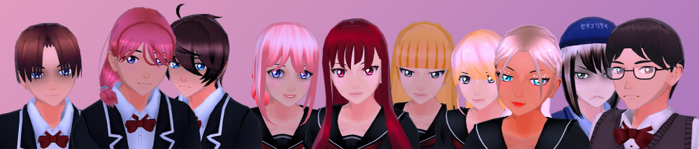

## About Nightlight Secrets

After losing your parents last year, your brother Fukoshi Hoshi has become depressed and afraid. He is now attending the same school as you, but he is faced with a challenge…bullying. You, Akai Hoshi must find the bullies who torment Fukoshi and put a stop to it at any cost.

Use stealth to change the course of events, sabotage people’s actions to suit them to your needs, manipulate others to carry out your plan, and if the situation calls for it...use violence as a last resort. Avoid gathering others' attention by hiding in plain sight, prevent Fukoshi from going through more pain than he already has before it is too late!

And remember what your mother told Akai...follow the light.

Every choice you make is going to impact the game's story. Various endings are available. Will you be able to get them all? Every student in the school is randomly generated, meaning that every player will have a unique experience. Only a few main characters will remain the same, like Akai's brother, the bullies... and few other.

## Features

**• Story Mode**\
Discover the story mode.

**• Free Missions Mode**\
Replay all the missions from the story mode at any time, and try to get the top of the leaderboard with the higher score possible.

**• Explore Mode**\
Travel through the various location you visited at least once in the story mode.

**• Characters**\
Check out even more details about the characters you met at least once in the story mode.

**• Music Player**\
Jam and remix all of the game's soundtrack composed by Raphael Neko!

**• Achievements**\
The game is full of achievements that you have to unlock! Will you be able to get them all?