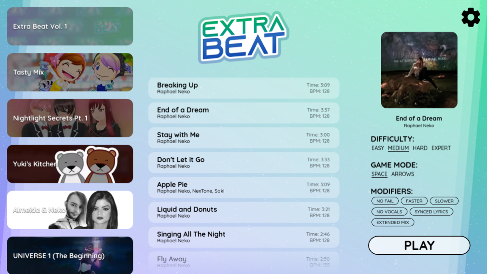

### ⚠️ If you haven't seen the post about scrapping Unity, we recommend you to read it first before this post for a better understanding!
### [Click here to read the post about scrapping Unity](../post?scrapping-unity)

 
 

 
 

# About Extra Beat removal

Due to all recent changes and concerns with Unity's runtime fees, we decided to takedown Extra Beat's latest version from the Google Play Store and the direct download to the Windows version.

Since then, we completely restarted the development of Extra Beat from scratch using Godot this time. This is also a great opportunity to rework some of the game's aspects that we were not satisfied with and also apply some of the players' feedbacks.

 
 

# What will change with the Extra Beat remake

## 🆕 Changes with the Extra Coin system

In the last Unity version of Extra Beat, you were able to earn Extra Coins depending on your final score at the end of playing a beatmap.\
You were able to use these coins to unlock new beatmap packs to play on much more music.

We believe that, as a player, if we only want to play on *Nightlight Secrets* or *Yuki's Kitchen*'s soundtrack that are locked behind a paywall with Extra Coins, having to play beatmaps that we don't want to play just for earning coins and then unlocking what we want is pretty discouraging and would make some player give up.

So, instead, the new purpose of the Extra Coins is to unlock in-game customization like new themes, new audio feedbacks... and much more!

 

## 🆕 New beatmaps menu

Instead of having one menu for beatmap packs, and another one for beatmaps (which was increasing so much the loading time), and one other for game's settings like the audio feedback and the extreme mode, we decided to merge them in one single menu!

All the packs are listed on the left side of your screen, all the beatmaps are listed on the middle of your screen, and the right side of your screen is for viewing the beatmap details and game's settings.

 
 
 

## 🆕 New difficulties

The Unity version of Extra Beat only had one single difficulty, and you could enable an *Extreme Mode* that was only making the speed of the song faster (like some kind of nightcore).

As of now, 4 difficulties that changes the amount of notes to press in sync are available!

 
 
 

## 🆕 New modifiers

A bunch of modifiers are now available*!

| | |
| ----- | ----- |
| **No Fail** | Play the beatmap without missing any note or it's a game over! |
| **Faster / Slower** | Changes the music's speed. |
| **No Vocals\*** | Plays the instrumental version of the song. |
| **Synced Lyrics\*** | Adds the synced lyrics on-screen while playing the map. |
| **Extended Mix\*** | The music's mix will be much longer. *(~4 to 5 minutes max.)* |

*\*Some modifiers are not compatible with some maps and some game modes.*

 

## 🆕 Visual improvement

The gameplay visuals in the last Unity version of Extra Beat are pretty... boring to be honest.\
The new remake will get an overall visual upgrade with some customizable themes.

 

## 🆕 New game mode

This new Extra Beat remake will contain a brand new *Space Mode*.

More information about it will be available when we will annouce the remake's release date with a new video trailer.

 

## 🆕 Obviously, tons of new music!

This new remake will be shipped with +10 packs!\
Some of them are returning from the previous Unity version, some were even updated and improved!

 
 

# Release date

As of now, it is too early to announce a proper release date!\
We will announce it when we feel like this is the right time.

 

## Thank you for your interest into Extra Beat!