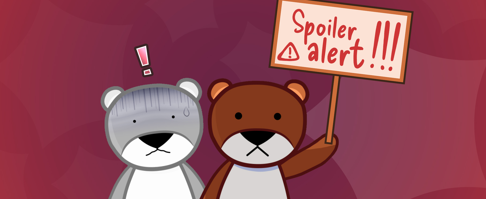
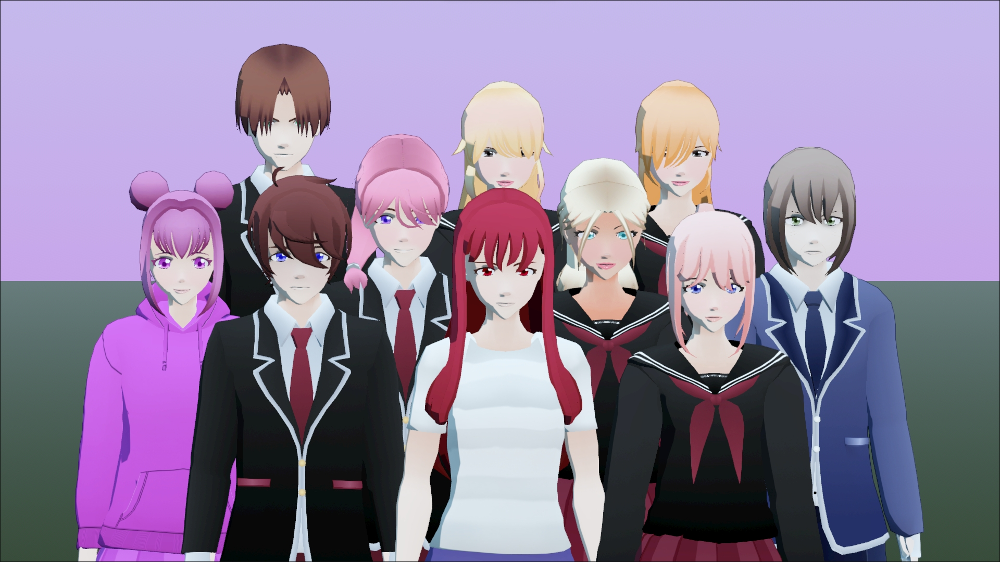
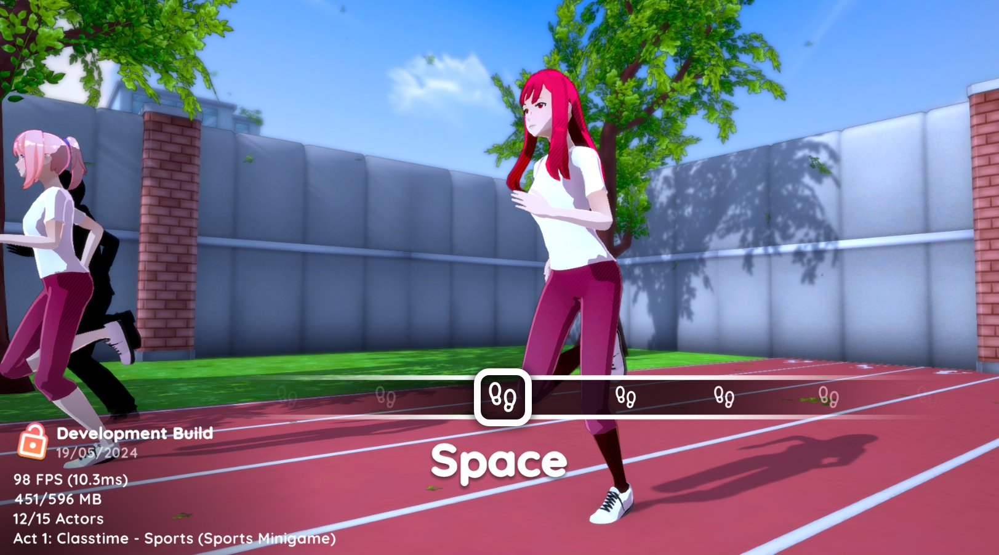

# ⚠️ This post contains spoilers about the story mode! If you don't want to get spoiled and discover the final game by yourself, please don't read what's below!!

 
 

Hi there! We know how excited you are about Nightlight Secrets and how hyped you all are for the final game. While this is hard to keep you updated about the progress without spoiling you the story mode, we decided to give you some news about what has been made, what has changed, and some previews! ✨

 

## In case you missed it:
Before starting to give you some news, here's a quick recap of things that was previously announced.

- SFH was rebranded to Nightlight Secrets! It is nothing more than a new name for the game. The story and characters are still almost the same as you remember from the Early Access version on Steam.

- The rebrand has already been pushed to Steam, but the game's build is still containing the old SFH name. This is normal, everything in-game will change once the final update releases!

- We fully switched from the Unity game engine to Godot!

If you want more details about the subjects above, please check out our other posts on our website.

Alright, now that you are aware of these things, let's keep going!

 

## Learning from the Early Access flaws and the players feedback to update the Act 1

We watched YouTubers playing the currently available Act 1 from the Early Access and listened to all the players feedback. This was a great opportunity to revisit what players didn't liked and tweak it for a better experience.

 

⚠️ *Please note that some of the footages and previews that you might see below were recorded from the previous Unity version that was entirely made in collaboration with TwistedSphere using the Harmless Lies engine. If that the case, it will be mentioned below the footage. Remember that things are not final and might be different in the final Godot version of the game!*

 

### 1. A visual refresh for the characters

The character base has been changed, thanks to the help of TwistedSphere who provided us with a similar base from their own game, and even more great work to improve the existing characters with new textures and new outfits. With all these changes, we have even more ways to make characters being different from each other, and overall characters looks more mature, stylized, and stands out from the previous base model that was over-used in too many other games.

*(screenshot from Godot, characters design are not final and are subject to get updated)*

 

### 2. The dream sequence

One thing that players really didn't like about the dream sequence was that long maze that just takes too much time to finish and that feels boring. Then the second dream sequence part where you have to find the right order of the "pressure plate" to keep going in the dream was also very boring and not enjoyable at all.\
In case you forgot how it was, here it is:

<video controls controlslist="nodownload" playsinline oncontextmenu="return false;">
	<source src="../posts/nls-updates-march-2025-img/SFHDreamSequence.mp4" type="video/mp4"/>
</video>

*(recorded from the early access version on Steam. Some parts were accelerated by 400% as they were too long.)*

This dream feels out of place in the game's story, so instead, TwistedSphere came with a much better idea, something that actually gives even more hints and details about Akai's past and childhood memories. They created brand new animations and a completely different environment.\
Take a look at the new dream sequence they made:

<video controls controlslist="nodownload" playsinline oncontextmenu="return false;">
	<source src="../posts/nls-updates-march-2025-img/NLSDreamSequence.mp4" type="video/mp4"/>
</video>

*(recorded from Unity. The sequence might be different in the final version.)*

As you can see, the first part of the dream is very inspired from the maze. Instead of randomly running without knowing where to go, you have to actually follow the light this time.\
Then, the light turns into one of Akai's childhood memory.

Future dream sequences in other acts will follow this pattern where Akai sees her mother as a light and she turns into some other childhood memories. But some other nightmare sequences we planned will not be about Akai's childhood at all.

 

### 3. Updated voice lines and animations

For some reason, people really disliked Emiko's voice lines- So our amazing and talented voice actress, GeekyVoiceActs, re-recorded brand new voice lines for Emiko that matches even better the cutscene!\
In addition to this update, TwistedSphere helped us making the characters much more expressive by providing new animations, which makes the dialogue even more dynamic. They also helped us a lot improving some existing cutscenes and dialogues. Here is one of them:

<video controls controlslist="nodownload" playsinline oncontextmenu="return false;">
	<source src="../posts/nls-updates-march-2025-img/NLSAct1EmikoDialogue.mp4" type="video/mp4"/>
</video>

*(recorded from Unity. The sequence might be different in the final version.)*

 

### 4. Brand new classtime sequence

The maths minigame at classtime was... more than boring. So we replaced it with a sports rhythm game instead!

*(concept image)*

Our goal is to add even more fun and enjoyable minigames based on other school subjects. We already have ideas for subjects like science and other sports like basketball, but if you have some ideas feel free to let us know in our Discord server! *(link to our Discord in the footer of the website!)*

 

## Adding more gameplay value

In the Godot version, we took the time to add a few extras to enjoy.

### 1. Free Missions

When playing the story mode, you sometimes have to play some missons (as an example, the one in the Early Access where you have to get Emiko's stolen phone from Kuroe's bag). From now on, after playing one of these missions at least once, you can freely play them in the "Free Missions" mode with some special or different objectives, and a leaderboard has also been added to add some competition between players.

### 2. Exploration

As you play the story mode, you will discover new environments and places. Once you discover it at least once in the story mode, you unlock it in the "Exploration" mode to freely move around, be even more familiar with it, or even discover some hidden secrets.

### 3. Characters viewer

As you play the story mode, you will meet different people. You will unlock them in the "Character viewer" mode, allowing you to learn more details about them.

### 4. Music Player

In the Early Access version, you were able to play the "Extra Beat" minigame. But since Extra Beat became its own standalone game, here it was replaced by a simpler music player in Nightlight Secrets.\
It might sounds like a downgrade, and it might also sound useless to add a music player in the game's extras as the soundtrack is available on all streaming platforms anyway, but we added a few things to make it more enjoyable and fun like some effects you can toggle and a speed controller.

### 5. Credits

The credits are visible at any time from the extras. But to avoid spoiling the player from seeing some of the story mode content, some contents are locked, and you have to finish the full story mode to enjoy the full end credits.

 

## Some other changes

Here is a list of some other changes and new things that were made since the switch from Unity to Godot.

- **User interface overall** 🖌️

To better match the new branding of the game, the user interface went through a major overall with brighter colors and some modern elements.\
More animations has been also added on the user interface for a much more dynamic navigation.

Some other aspects of the user interface was reworked to make the game even more user friendly! From now on, when unlocking something like an achievement or something in the extras you will get a notification on screen.

 

- **New soundtrack** 🎵

The first act contains some new soundtracks that fits better some of the sequences. (You can even already hear some snippets of a few of them through the footages shown in this post!)\
With all the new soundtrack composed, and a total of +50 different tracks, we have more than enough to make sure each sequence feels different and have a fitting track.\
Don't worry about the previous soundtrack! It will be reused in later acts.

 

- **More controllers supported** 🎮

By switching to Godot, supporting even more controllers is easier than ever! From the PS3 to the PS5 controllers, from the Xbox 360 to the latest Xbox controller, from the old Steam controller to the Steam Deck inputs, the Nintendo Switch Joy Cons and Pro Controller, even more obscure controllers like the Google Stadia or the Ouya, or just generic controllers, the game is now able to smoothly display the correct input keys on screen without any extra lines of code and most importantly without impacting the performances at all!

 

- **Better support for localization** 🌐

Thanks to the port to Godot, localizing things to other languages in the game is easier than ever without impacting the performances too.\
As the development goes, we are making sure that every piece of text is ready for being localized. During the development process, we direcly both write the text in English and French, which already 100% confirms the inclusion of these two languages for the final release.

Also, before the final release, we will open a recruitment for volunteers who want to localize the game into their native language. Volunteers will obviously get credited, and be provided with an early release of the final release so they can get an idea of what they are translating.\
For now, it is too early to open this recruitment since pieces of texts are constantly getting added or edited over the time. We will make an announcement when we feel like this is the right time.\
And even if your native language wasn't added on the final release, don't worry, the recruitment will still be opened so anyone can contribute their desired language that will be added in a later update!

 

- **More settings for the best experience** 🛠️

You can now tweak much more settings to ensure that everyone can play smoothly on different devices, like more graphics settings.\
In addition to that, more audio and gameplay settings has been added to ensure a better accessibility!

 
 

## An unfortunate small downgrade in our initial plan 🙏

People really loved how the Early Access version had fully animated and voice acted cutscenes, and we really loved to work on them too. But unfortunately, due to a very limited budget, you might see a small difference with next acts with less voice acting. To compromise this downgrade, we will do our best to make the cutscenes as polished as possible with some animations, some parts of some existing voice lines that we already have, and an overall good sound design. You probably already noticed it through the footages shown above about the Act 1 revamp by the way.\
We are sorry for this change and we really hope that you will still enjoy the game's story anyway!

 
 

## Special thanks 💖

We would like to also express our gratitude to a few people who really helped us through these years to make the project come together:

- **TwistedSphere**\
	They really helped us pushing the game to a whole another level, not only by remaking and improving all that was done before in their own engine, but also by being there with us since a couple of years. Without them, the game wouldn't be as good as it is right now.\
	If you love Nightlight Secrets, you should definitely consider checking out their own game, <a href="https://store.steampowered.com/app/3005250/Harmless_Lies/" target="_blank">Harmless Lies</a>.

- **Jake**\
	Despite not being around in the project anymore, Jake helped us from the very old PTB 2 to a few years after the early access version released. Over the years, Jake helped us a lot with some amazing code base upgrade and optimization, and with coming up with some new ideas for a few acts that comes after the first one.

- **GeekyVoiceActs**\
	A true shining star that always brings joy around everywhere she goes! Not only she has been giving her voice to Emiko since the early access version of the game, but she also never lost her faith into our game. You should definitely check out <a href="https://www.youtube.com/@geekyvoiceacts" target="_blank">her YouTube channel</a> where she does tons of great videos with Princess Peach, Daisy and Rosalina from the Super Mario universe!

- **Our amazing voice actors**\
	A special thanks to **Kirsten Candelore "Jinkles"**, **Roberto Benavides "TheBurningFaith"**, and **Valentine Rivera "BodegaBelmont"**, who made some of our characters come alive by providing their incredible voices for the game!

- **Our players and our community**\
	Especially thanks to you for enjoying what we do and for all the support!

 
 

# Conclusion

That was a really long post! But we hope that this will help people that still thinks that the game has been scrapped actually seeing that we are still on it after all these years.

Thank you so much for reading this post, thank you for your time, for your support in general! 🌠💖