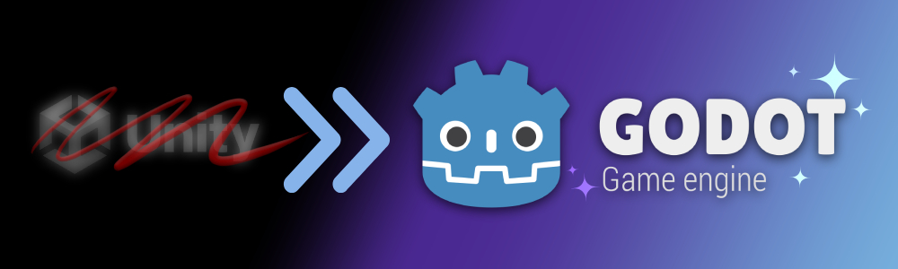
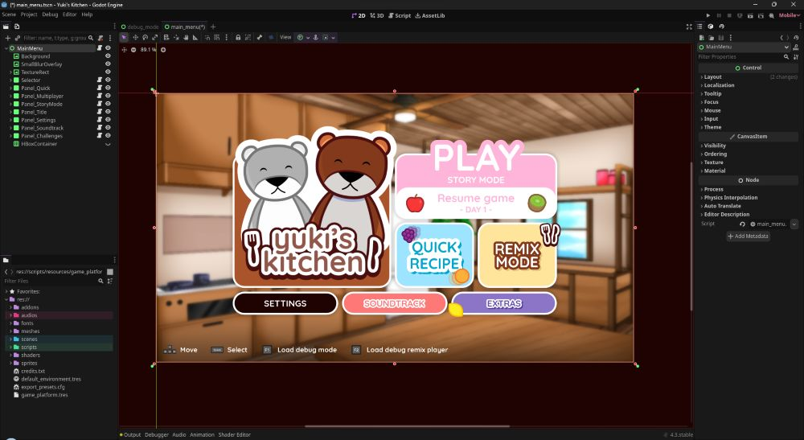

## It's time to say good bye to the Unity game engine. 👋

<!-- <iframe src="https://www.youtube.com/embed/OEcQJVboBmQ?color=white&rel=0&playsinline=1" color=white frameborder="0" allow="accelerometer; autoplay; clipboard-write; encrypted-media" referrerpolicy="strict-origin-when-cross-origin" allowfullscreen></iframe> -->

In September of 2023, Unity Technologies announced their new plan pricing and packaging updates to introduce a new runtime fee system. This new concerned a lot of game developers and companies across the world.\
In short, Unity Technologies decided that at a certain threshold of installation for our games we, the game developers and game companies, would have to pay them a fee that was $0.20 per install.

Then, after almost two weeks, Unity Technologies decided to reconsider their decision. They cancelled the runtime fee, but we were still concerned about one specific thing: Since we are using Unity Personal (the free plan), if our revenue and funding reaches \$200,000 USD a Unity Pro subscription plan of \$2,200 USD per year and per seat is required.

Since we are a small team working on our free time, we do not want to pay for any subscription plan, and we cannot afford it anyway since developing games is not our main job and, once again, we only work on our free time.

After seeing a lot of game developers being disappointed into Unity Technologies decisions and seeing them trying out some other game engines, one in particular caught our attention...

 
 

# Introducing Godot! 🤖

After looking for a good alternative to Unity, one game engine was standing out.\
Godot is a free, open-source, and cross-platform game engine that fits exactly our needs: something fast and free that can easily allow us to develop various 2D, 3D and even VR games for multiple devices!

It took us some time to get used to the Godot Engine, especially after using Unity for so many years, but we can say that we are already very comfortable to work with it.

Godot has an incredible community with a lot of people helping each other, making tutorials, and even has a very complete and helpful documentation. As Godot is open-source, a lot of contributor helps the game engine growing and improving every day.

Since we started to learn how to use Godot, we were impressed by its flexibility and built-in tools that already improves our workflow. We were already able to easily prototype games faster than ever, and we even already started some upcoming projects like *Nightlight Secrets*, *Extra Beat*, and *Yuki's Kitchen*.

We feel pretty confident that all of our game projects can be fully developed using the Godot Engine, and we can't wait to be able to share with you our first "Made with Godot" game very soon!