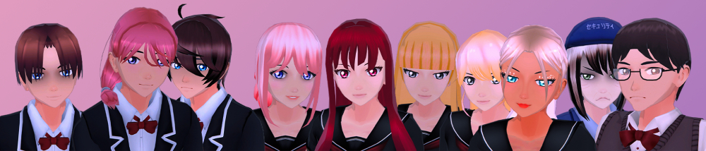

## This game with a peculiar name...
### ...that was also nicknamed "SFH", or "Sudoku For Him"...

 

# A new name, a new start.

Since this game's first early access release on Steam in November 2021, we knew that the game's name would be a problem for reaching various players from all the ages and that the only people who could play might need to be adult.

The game's name wasn't the only problem too: at first, the story planned was much *'edgy and darker'* too, so in any case just changing the game's name would not change the game's rating at all.

After thinking for a while, we revisited many aspects of the game's story. Same characters, same environments, and almost same story.

 

# Suspending the early access updates

Like said in a 2 years old post, we feel like releasing the game in Early Access and wanting to release frequent updates to add more acts was a complete mistake, especially for a game project that is being worked on free-time. This game is mainly supposed to be a story based game, where you follow the protagonist's life, complete various missions, travel through dreams and nightmares, and make strong decisions.

We can't wait to show you the impressive work we did over the past years on the full game. There's so much new stuff, new characters, new twists, new environments, and new music too!

The plan for the game is that we will keep working on it like we were doing for the past years, and we will release the full and final version of the game along side the rebranding on Steam whenever we are done with everything missing.

 

# Why does it take so long?

Starbit Light is a small team of people who are passionate into game development. We are working together on projects, but not all the time because we do this in our free time.\
Starbit Light isn't a video game company, this means that the projects we are working on are not our job and we are not earning anything from it for now.\
We work on the projects beside having a life, and a job too (that isn't developing games).

 

# The rebranding

We are really happy to finally announce that "SFH" is getting rebranded to "**Nightlight Secrets**"!

 

# Q&A

## WHAT DOES THIS CHANGE MEANS?
Don't worry, the game is still the same as you remember! All the characters, the story, backstory... will remain (almost) the same. This is mostly nothing more than a "remade from scratch code base in a new game engine that improves the original game with a brand new name".

## WHAT IF I ALREADY PURCHASED "SFH" BEFORE?
If you already purchased the game as "SFH", then no worries! The game will simply get updated in your Steam library from "SFH" to "Nightlight Secrets".

## WHY "NIGHTLIGHT SECRETS"?
As told, we're very careful about our players feedback. We noticed that the previous name wasn't very appropriated, and it wasn't really reflecting how the game changed over the past years.\
Nightlight Secret, the game's new name, reflects the mysterious secrets of the story but also the dreams and nightmares you are able to play as Akai. This new name will also allow us to attract a younger player base too, meaning that the game's rating will be re-ajusted as well.

## WHEN WILL IT RELEASE?
It is currently too early to announce when this major update will release. We know you are desperately waiting for a new update since the first release in November 2021, and we are really sorry about the long wait... However, please don't forget that this project is being developed by a really small team on their free time. As of now, you can still get the old "SFH" through Steam, and as said above you will receive the rebranding update as soon as we are ready to release it!

 

# Conclusion

I hope this message will reassure some of you who were doubting that Starbit Light was no longer active and that the game was scrapped. Thank you for your time and your patience.