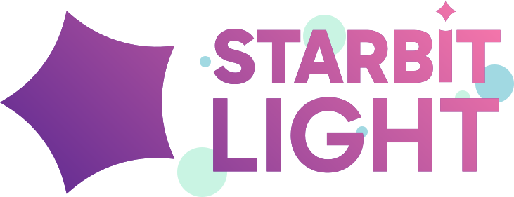

## A small story about the Starbit Light logo.

In 2020, when Starbit Light was founded, we made this logo that represented a small star with rounded edges:

This logo was fine, but after years of using it, we noticed a recurring issue with it. The way it's rotated makes it hard to properly align text beside it without looking a bit weird, and the little "shine line" was barely visible from far.

We could just tweak the rotation, remove the little "shine line", and call it a day, but we did even further than that.

 

## Introducing the new Starbit Light branding!

Here is the brand new logo! It fixes the rotation issue to keep the original star with rounded edges idea, removes the "shine line", and it now allow us to easily fit some text right next to it. Talking about text right next to it, here is also the new textual logo with a little star on the 'i' of Starbit! (The small blue dots around the logo are purely decorative by the way!)

*How refreshing~!* ✨

 

This new branding is already available in the <a href="../branding" target="_blank">branding page</a> if you want to take a closer look at it.\
It will also be applied to all other platforms like our socials in the next few days, so stay connected!

 
 

## Website updates

- After some requests, we updated the terms of use to include more details about the usage of our games in general. This change also include a section about fan-made content.

- Along side our logo update, the overall font across the website was changed from Quicksand to Gabarito.

- The branding page has been updated with our new logo and font.

- About the press kit:

	The press kit from the old website is currently missing here.
	It contained useful resources for content creators like logos, banners, screenshots and footages from our games.\
	This page will return in a later update, probably when the final Nightlight Secrets update will release!

 

## Other updates

- If you haven't notice, Nightlight Secrets new branding has been pushed to Steam! If you had the game, the name, logos and banners has been updated in your Steam library. The Steam store page has also been updated. Please note that the current build available on Steam still contains the previous game's name, so don't be confused if you see a different game name while playing!

- Along side the Steam updates mentioned above, we now have our own developer page on Steam! <a href="https://store.steampowered.com/developer/starbitlight" target="_blank">Check it out by clicking here!</a>

 
 
 

Thank you for your interest into Starbit Light and our projects! 💖\
Next post (which you are highly requesting) will be about the progress made on Nightlight Secrets! 🌠